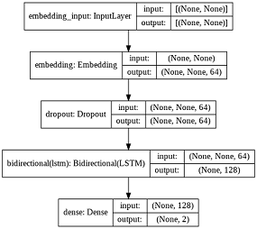

# Predicting Difficulty of a Quiz Bowl Question

Generally in a quiz bowl question, if the round reaches to the last sentence, it's usually that clue that gives away the question. So in theory, it should be possible to train a Machine learning model which can take that last sentence and predict the difficulty of that question (whether it's suitable for a college student or a high school student).

This model, when trained can be used to assist the question setter (or even work alongside a model which can generate questions from the Wikipedia dataset).

* Dataset used: [Link to the page containing the json file](https://sites.google.com/view/qanta/resources)

* The data-extraction steps are as illustrated in the [DataExtract.ipynb](./DataExtract.ipynb) notebook.

* The data-preprocessing steps are as illustrated in the [Preprocess.ipynb](./Preprocess.ipynb) notebook.

* Further processing using NLTK and training is given in the [training_colab.ipynb](./training_colab.ipynb) notebook. 

## Model Architecture: 

## Results and further scope of improvement: 

* Got an accuracy of 66.2% on the test split after training for 5 epochs.

* I expect the accuracy should increase if we train for longer and/or improve the model architecture.
